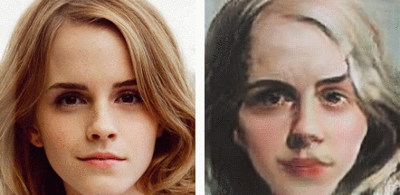
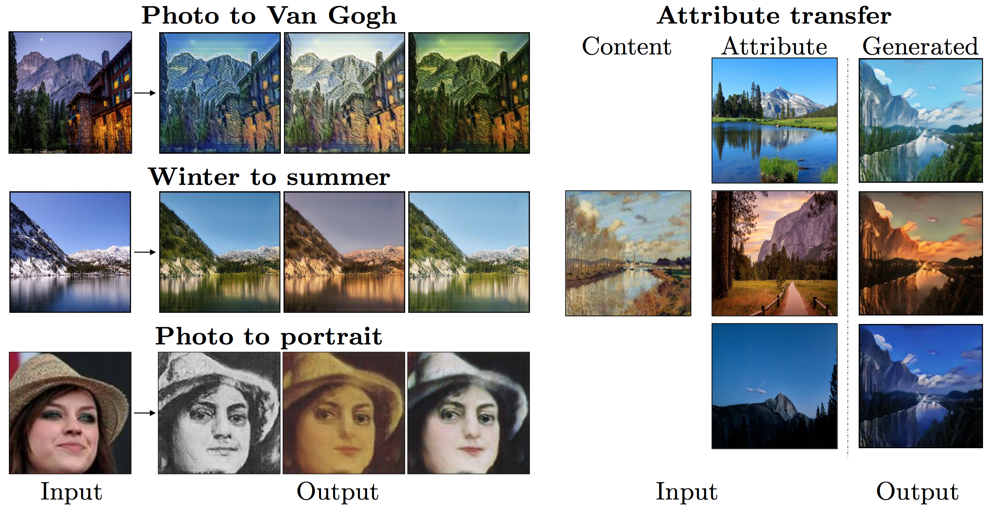
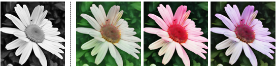

# Diverse Image-to-Image Translation via Disentangled Representations
[[Project Page]]()[[Paper]]()

Pytorch implementation for our diverse image-to-image translation method. With the proposed disentangled representation approach, we are able to produce diverse translation results without paired training images.

Contact: Hsin-Ying Lee (hlee246@ucmerced.edu) and Hung-Yu Tseng (htseng6@ucmerced.edu)

## Paper
Diverse Image-to-Image Translation via Disentangled Representations<br>
[Hsin-Ying Lee](http://vllab.ucmerced.edu/hylee/)\*, [Hung-Yu Tseng](https://sites.google.com/site/hytseng0509/)\*, [Jia-Bin Huang](https://filebox.ece.vt.edu/~jbhuang/), [Maneesh Kumar Singh](https://scholar.google.com/citations?user=hdQhiFgAAAAJ), and [Ming-Hsuan Yang](http://faculty.ucmerced.edu/mhyang/)<br>
European Conference on Computer Vision (ECCV), 2018 (**oral**) (* equal contribution)

Please cite our paper if you find it useful for your research.
```
@inproceedings{lee_drit_2018,
  author = {Lee, Hsin-Ying. and Tseng, Hung-Yu and Singh, Maneesh Kumar and Huang, Jia-Bin and Yang, Ming-Hsuan},
  booktitle = {European Conference on Computer Vision (ECCV)},
  title = {Diverse Image-to-Image Translation via Disentangled Representations},
  year = {2018}
}
```

## Example Results


## Usage

### Prerequisites
- Python 3.5
- Pytorch 4.0 and torchvision (https://pytorch.org/)
- [TensorboardX](https://github.com/lanpa/tensorboard-pytorch)
- [Tensorflow](https://www.tensorflow.org/) (for tensorboard usage)
- We provide a Docker file for building the environment based on CUDA 9.0 and CuDNN 7.1.

### Install
- Clone this repo:
```
git clone https://github.com/HsinYingLee/DRIT.git
cd DRIT/src
```

## Dataset
link for photo <-> portrait

## Training Examples
- Yosemite summer <-> winter translation
```
python3 train.py --dataroot ../datasets/yosemite -name yosemite
tensorboard --logdir ../logs/yosemite
```
Results and saved models can be found at `../results/yosemite`.

- Photo <-> portrait translation
```
python3 train.py --dataroot ../datasets/photo2portrait --name photo2portrait --concat 0
tensorboard --logdir ../logs/photo2portarit
```
Results and saved models can be found at `../results/photo2portrait`.

## Testing Example
- Download a pre-trained model
- Generate results with randomly sampled attributes
  - Require folder 'testA' (for a2b) or 'testB' (for b2a) under dataroot
```
python3 test.py --dataroot ../datasets/yosemite --name yosemite --resume ../models/example.pth --a2b 1 --num 5
```

- Generate results with given attributes
  - Require both folders 'testA' and 'testB' under dataroot
```
python3 test_transfer.py --dataroot ../datasets/yosemite --name yosemite --resume ../models/example.pth --a2b 1 --num 5
```
Results can be found at `../outputs/yosemite`.

## Training options and tips
- Due to the usage of adaptive pooling for attribute encoders, our model support various input size. For example, here's the results of Grayscale -> RGB using 340x340 images.


- We provide two different methods for combining content representation and attribute vector. One is simple concatenation, the other is xxxxx. In our experience, if the translation involves less shape variation (e.g. Winter2Summer), simple concatentation produces better results. On the other hand, the translation with shape variation (e.g. cat2dog, celeb2portrait), xxx should be use (i.e. set --concat 0) in order to generate diverse results.

- In our experience, using multiscale discriminator also always gets better results.

- We also provide option for using spectral normalization(https://arxiv.org/abs/1802.05957). We use the code from the master branch of pytorch since pytorch 0.5.0 is not stable yet. However, despite using spetral normalization significantly stablizes the training, we fail to observe consistent quality improvement. We encourage everyone to play around with various settings and explore better configurations.

- Since the log file will be large if you want to dispaly the images, set "--no_img_display" if you like to display only the loss values.
